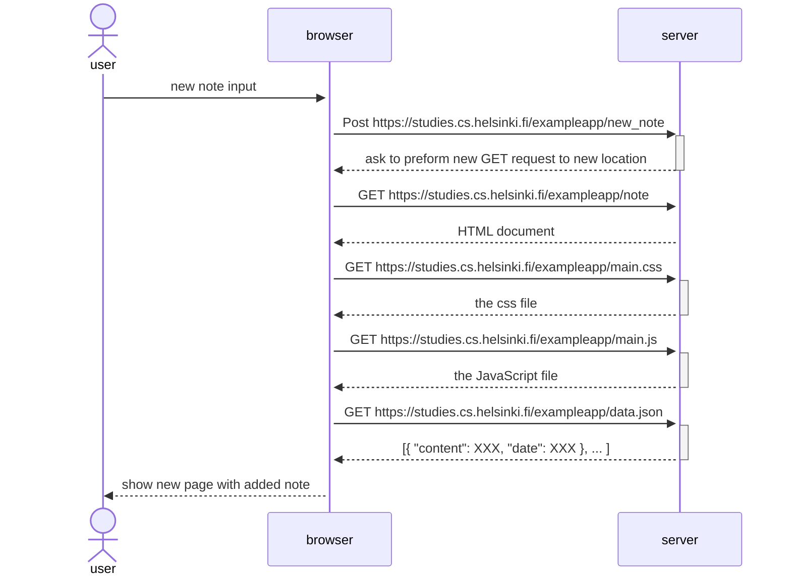

```mermaid
sequenceDiagram
actor user
participant browser
participant server
    user->>+browser: new note input
    browser->>+server:  Post https://studies.cs.helsinki.fi/exampleapp/new_note
    server-->>-browser: ask to preform new GET request to new location
    browser->>+server:  GET https://studies.cs.helsinki.fi/exampleapp/note

    server-->>browser: HTML document
     browser->>server: GET https://studies.cs.helsinki.fi/exampleapp/main.css
    activate server
    server-->>browser: the css file
    deactivate server

    browser->>server: GET https://studies.cs.helsinki.fi/exampleapp/main.js
    activate server
    server-->>browser: the JavaScript file
    deactivate server
 browser->>server: GET https://studies.cs.helsinki.fi/exampleapp/data.json
    activate server
    server-->>browser: [{ "content": XXX, "date": XXX }, ... ]
    deactivate server
    browser-->>user: show new page with added note

```
